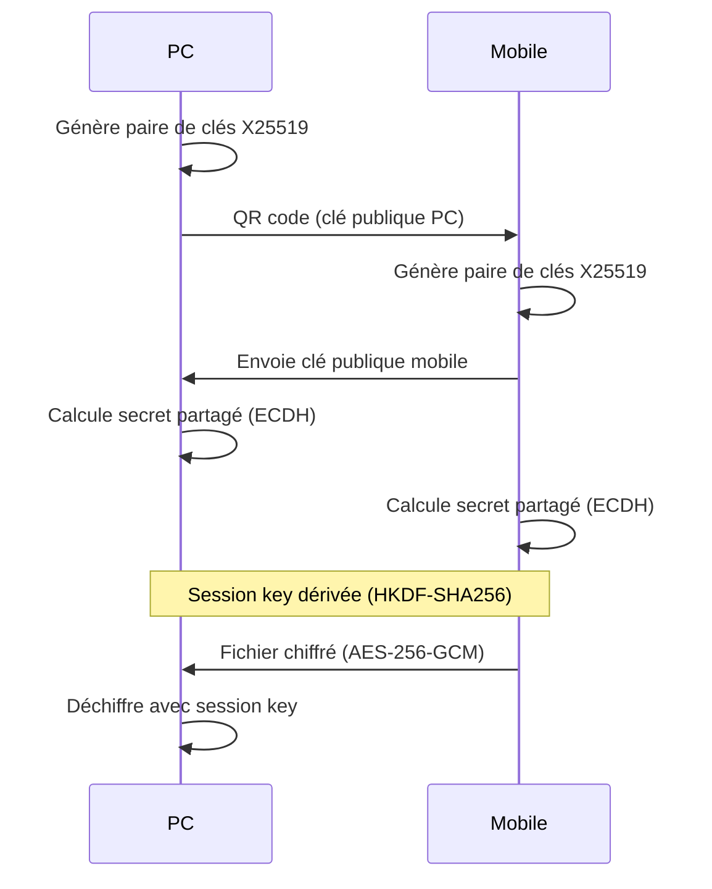

# BridgeX 🌉

[](https://github.com/Youni-G5/bridge-x/actions/workflows/ci-rust.yml)
[](https://github.com/Youni-G5/bridge-x/actions/workflows/ci-flutter.yml)
[](https://github.com/Youni-G5/bridge-x/actions/workflows/ci-tauri.yml)
[](https://opensource.org/licenses/MIT)
[](https://github.com/Youni-G5/bridge-x/releases)

**Transfert de fichiers P2P local et sécurisé** entre votre PC et mobile. Aucun cloud, aucun compte, juste des connexions directes chiffrées.

> 🎉 **Version 0.1.0 disponible !** - Téléchargez et installez en 2 minutes.

---

## 📥 Téléchargement

### 🖥️ Desktop

<div align="center">

| Windows | macOS | Linux |
|---------|-------|-------|
| [](https://github.com/Youni-G5/bridge-x/releases/latest/download/BridgeX-setup.exe) | [](https://github.com/Youni-G5/bridge-x/releases/latest/download/BridgeX.dmg) | [](https://github.com/Youni-G5/bridge-x/releases/latest/download/BridgeX.AppImage) |
| `.exe` installer | `.dmg` installer | `.AppImage` / `.deb` |

</div>

### 📱 Mobile

<div align="center">

| Android | iOS |
|---------|-----|
| [](https://github.com/Youni-G5/bridge-x/releases/latest/download/BridgeX.apk) |  |
| `.apk` direct | TestFlight bientôt |

</div>

### 📖 [Guide d'installation détaillé →](INSTALL.md)

---

## ✨ Fonctionnalités

<table>
<tr>
<td width="50%">

### ✅ Disponible maintenant

- 🔐 **Chiffrement E2E** : X25519 + AES-256-GCM
- 📱 **Appairage QR** : Connectez en 5 secondes
- 📤 **Transfert rapide** : Fichiers par chunks
- 💾 **100% local** : Aucun serveur cloud
- 🖥️ **Multi-plateforme** : Windows, macOS, Linux
- 📲 **App mobile** : Android (iOS bientôt)
- 🚀 **Zéro config** : Fonctionne immédiatement
- 🎯 **Drag & drop** : Glissez des fichiers

</td>
<td width="50%">

### 🚧 Prochainement

- 📋 Sync du presse-papiers
- 🖼️ Partage d'écran / remote
- 🔄 Sync bidirectionnelle dossiers
- 🌐 WebRTC P2P (NAT traversal)
- 🔔 Notifications push (mobile)
- 📊 Historique des transferts
- 🌍 Multi-langue
- 🔌 Système de plugins

</td>
</tr>
</table>

---

## 🚀 Démarrage rapide (2 min)

### Étape 1 : Installer

**Sur PC** : Téléchargez et installez depuis [les releases](https://github.com/Youni-G5/bridge-x/releases/latest)  
**Sur Mobile** : Téléchargez l'APK et installez

### Étape 2 : Connecter

1. **Sur PC** : Ouvrez BridgeX → Cliquez "Appairer un appareil" → Un QR code s'affiche
2. **Sur Mobile** : Ouvrez BridgeX → "Scanner QR" → Pointez vers le QR code
3. ✅ **Connecté !** Vos appareils sont maintenant liés

### Étape 3 : Transférer

**De mobile vers PC** :  
- Sélectionnez votre PC → "Envoyer fichiers" → Choisissez les fichiers → Envoyez

**De PC vers mobile** :  
- Glissez un fichier dans la fenêtre **OU** cliquez "Envoyer" → Choisissez le fichier

**C'est tout !** 🎉 Tous les transferts sont chiffrés automatiquement.

---

## 🔒 Sécurité & Confidentialité

### Pourquoi BridgeX est sûr ?

✅ **Pas de cloud** - Vos fichiers ne transitent jamais par internet  
✅ **Chiffrement E2E** - Chaque fichier est chiffré avec AES-256-GCM  
✅ **Réseau local uniquement** - Les données restent sur votre WiFi  
✅ **Aucun compte requis** - Aucune inscription, aucune connexion  
✅ **Open source** - Code auditable par tous  
✅ **Forward secrecy** - Nouvelles clés à chaque session

### Comment ça marche ?



Voir [SECURITY.md](SECURITY.md) pour les détails techniques.

---

## 🏗️ Architecture technique

<details>
<summary><b>Cliquez pour voir l'architecture complète</b></summary>

```
┌─────────────────────────────────────────────────────┐
│                   User Devices                      │
├──────────────┬──────────────────────────────────────┤
│   Desktop    │           Mobile                     │
│   (Tauri)    │          (Flutter)                   │
│              │                                      │
│  ┌────────┐  │  ┌────────┐                          │
│  │  UI    │  │  │  App   │                          │
│  └───┬────┘  │  └───┬────┘                          │
│      │       │      │                               │
│  ┌───▼────┐  │  ┌───▼────┐                          │
│  │Backend │  │  │API Svc │                          │
│  │ (IPC)  │  │  │ (HTTP) │                          │
│  └───┬────┘  │  └───┬────┘                          │
│      │       │      │                               │
└──────┼───────┴──────┼───────────────────────────────┘
       │              │
       ▼              ▼
   ┌─────────────────────┐
   │  Backend Server     │
   │  (Rust + Axum)      │
   │                     │
   │  • REST API         │
   │  • SQLite DB        │
   │  • Crypto Engine    │
   │  • File Transfer    │
   └─────────────────────┘
```

### Stack technologique

- **Backend** : Rust + Axum + SQLite + X25519/AES-GCM
- **Desktop** : Tauri 2.0 (Rust + HTML/CSS/JS)
- **Mobile** : Flutter (Dart)
- **Crypto** : x25519-dalek, aes-gcm, HKDF-SHA256
- **Database** : SQLx + SQLite

</details>

---

## 👨‍💻 Pour les développeurs

<details>
<summary><b>Setup local & build depuis les sources</b></summary>

### Prérequis

- **Rust** 1.70+ (`rustup` recommandé)
- **Flutter** 3.0+ (pour mobile)
- **Node.js** 18+ (pour Tauri)

### Installation one-command

```bash
# Cloner et bootstrapper
git clone https://github.com/Youni-G5/bridge-x.git
cd bridge-x
chmod +x scripts/*.sh
./scripts/bootstrap.sh
```

### Lancer en développement

```bash
# Backend
cd backend && cargo run --release

# Desktop
cd desktop && cargo tauri dev

# Mobile
cd mobile && flutter run
```

### Builder pour production

```bash
# Build tout (Windows, macOS, Linux, Android)
./scripts/build_release.sh

# Ou individuellement
cd desktop && cargo tauri build        # Desktop
cd mobile && flutter build apk         # Android
```

### Tests

```bash
./scripts/run_all_tests.sh  # Tous les tests
cd backend && cargo test    # Backend seulement
cd mobile && flutter test   # Mobile seulement
```

Voir [CONTRIBUTING.md](CONTRIBUTING.md) pour plus de détails.

</details>

---

## 🗺️ Roadmap

### v0.1.0 (MVP) - ✅ Disponible maintenant !

- [x] Transfert de fichiers basique
- [x] Appairage QR code
- [x] Chiffrement E2E
- [x] App desktop (Tauri)
- [x] App mobile (Flutter Android)
- [x] Base SQLite
- [x] Uploads par chunks
- [x] File picker fonctionnel
- [x] Drag & drop support
- [x] Auto-update intégré

### v0.5.0 (Beta) - 🚧 En cours

- [ ] Synchronisation presse-papiers
- [ ] Connexions WebRTC P2P
- [ ] Interface historique transferts
- [ ] Sélection multiple fichiers
- [ ] Sync de dossiers
- [ ] App iOS (TestFlight)

### v1.0.0 (Stable) - 📋 Planifié

- [ ] Partage d'écran
- [ ] Contrôle remote bureau
- [ ] Système de plugins
- [ ] Support multi-langue
- [ ] Interface paramètres avancés
- [ ] Service background (mobile)

Voir [issues](https://github.com/Youni-G5/bridge-x/issues) pour plus de détails.

---

## 📊 Statistiques

- **Lignes de code** : ~4,500+
- **Langages** : Rust, Dart, JavaScript
- **Tests** : 15+ tests automatisés
- **CI/CD** : 4 GitHub Actions workflows
- **Plateformes** : 4 (Windows, macOS, Linux, Android)
- **Stars** : ⭐ Si vous aimez, donnez une star !

---

## 🤝 Contribuer

Les contributions sont les bienvenues ! Voir [CONTRIBUTING.md](CONTRIBUTING.md).

**Démarrage rapide pour contribuer** :

```bash
# 1. Fork & clone
git clone https://github.com/VOTRE_USERNAME/bridge-x.git
cd bridge-x

# 2. Créer une branche
git checkout -b feature/ma-super-fonctionnalite

# 3. Faire vos changements et tester
./scripts/run_all_tests.sh

# 4. Commit (conventional commits)
git commit -m "feat: ajout de ma fonctionnalité"

# 5. Push et créer une PR
git push origin feature/ma-super-fonctionnalite
```

---

## 📚 Documentation

- 📥 [**Guide d'installation**](INSTALL.md) - Installation pas-à-pas
- 🏗️ [Architecture](docs/architecture.md) - Design système
- 🔐 [Sécurité](SECURITY.md) - Modèle de menaces
- 🔧 [API OpenAPI](docs/openapi.yaml) - Spec REST API
- 🐳 [Self-hosting](docs/HOWTO_SELFHOST.md) - Déployer votre serveur
- 🤝 [Contribuer](CONTRIBUTING.md) - Guide contribution

---

## 💬 Support

- 🐛 **Bugs** : [GitHub Issues](https://github.com/Youni-G5/bridge-x/issues)
- 💭 **Discussions** : [GitHub Discussions](https://github.com/Youni-G5/bridge-x/discussions)
- 🔒 **Sécurité** : Voir [SECURITY.md](SECURITY.md)

---

## 📄 Licence

MIT License - voir [LICENSE](LICENSE) pour détails.

---

## 🙏 Remerciements

- [Tauri](https://tauri.app/) - Framework desktop
- [Flutter](https://flutter.dev/) - Framework mobile
- [Axum](https://github.com/tokio-rs/axum) - Framework web
- [x25519-dalek](https://github.com/dalek-cryptography/x25519-dalek) - Bibliothèque crypto

---

<div align="center">

**Si BridgeX vous est utile, donnez une ⭐ !**

[](https://star-history.com/#Youni-G5/bridge-x&Date)

**Fait avec ❤️ par la communauté BridgeX**

[Website](https://bridgex.dev) • [Twitter](https://twitter.com/bridgex_app) • [Discord](https://discord.gg/bridgex)

</div>
